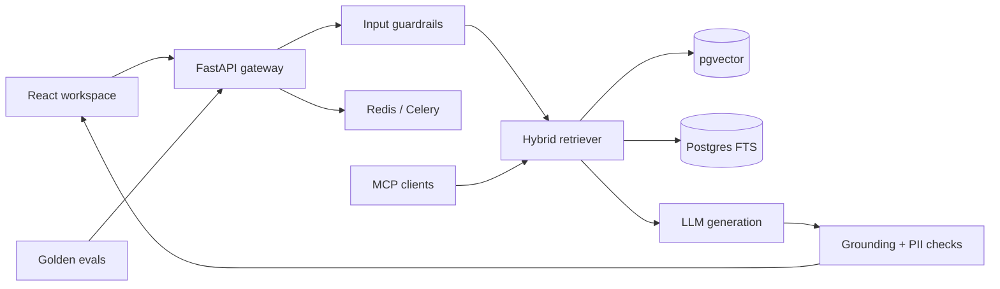

# Enterprise RAG Copilot

A production-oriented, multi-tenant Retrieval-Augmented Generation platform for internal knowledge. Built as a portfolio project for **AI Engineer, Generative AI Engineer, and Python Backend Engineer** roles.

    

## What makes this industry relevant

- **Grounded RAG:** document ingestion, overlap-aware chunking, hybrid dense/sparse retrieval, metadata filters, citations, and refusal when evidence is missing.
- **Evaluation-driven delivery:** golden dataset, deterministic graders, grounding checks, and a CI quality gate.
- **Layered guardrails:** prompt-injection detection, PII redaction, strict schemas, file validation, RBAC, tenant isolation, and safe refusal.
- **Agent interoperability:** MCP server exposes tenant-scoped knowledge search and administrator-only ingestion tools.
- **Production operations:** structured logs, Prometheus metrics, trace IDs, readiness/liveness endpoints, Celery worker, Redis, pgvector/PostgreSQL architecture, Docker, and GitHub Actions.
- **Professional UI:** responsive React/TypeScript workspace with source cards, relevance scores, uploads, department filtering, and grounded-status feedback.

## Architecture



## Run locally

The default mode is deterministic and requires no paid API.

```bash
git clone https://github.com/ludacris123/enterprise-rag-copilot.git
cd enterprise-rag-copilot
cp .env.example .env
docker compose up --build
```

Open:
- React application: http://localhost:5173
- FastAPI documentation: http://localhost:8000/docs
- Prometheus metrics: http://localhost:8000/metrics

For local backend development:

```bash
cd backend
python -m venv .venv
source .venv/bin/activate
pip install -e ".[dev]"
uvicorn app.main:app --reload
python -m evals.run
pytest -q
```

For the frontend:

```bash
cd frontend
npm install
npm run dev
```

## Production RAG pipeline

1. Authorized analysts upload approved documents.
2. Files are type/size validated and routed to background ingestion.
3. Clean text is split into overlap-aware chunks with document metadata.
4. Production adapters store embeddings in pgvector and lexical indexes in PostgreSQL FTS.
5. Queries are tenant-scoped, metadata-filtered, and scored with hybrid retrieval.
6. The model answers only from retrieved evidence and emits inline citations.
7. Output guardrails redact PII and flag weak grounding.
8. Trace IDs, metrics, feedback, latency, and retrieval scores support debugging and evaluation.

The repository includes an in-memory hybrid adapter so reviewers can run it immediately. Its interface is intentionally compatible with replacement by a pgvector/FTS repository without changing the API or UI.

## Evaluation strategy

`backend/evals/golden.jsonl` covers grounded answers, abstention, safety, department filters, and prompt injection. CI blocks merges when a regression fails.

Production expansion:
- Retrieval: Recall@K, MRR, NDCG, context precision
- Generation: correctness, faithfulness, citation coverage
- Safety: injection success rate, PII leakage, unauthorized cross-tenant retrieval
- Operations: p95 latency, token cost, error rate, feedback score
- Judge calibration: compare LLM judges with human labels before automation

## Security model

- JWT authentication with role and tenant claims
- Server-side tenant filtering for every retrieval operation
- Analyst/admin authorization for ingestion
- Untrusted-document instructions never enter the system instruction channel
- File type and size constraints
- PII redaction on input and output
- Secrets supplied through environment variables; production should use a secret manager
- High-impact MCP tools must be exposed only behind host authorization and approval

## MCP

```bash
cd backend
python mcp_server.py
```

Tools:
- `search_knowledge`: read-only, tenant-scoped retrieval
- `index_text`: privileged ingestion hook

## API examples

```bash
curl -X POST http://localhost:8000/api/v1/chat \
  -H "Content-Type: application/json" \
  -d '{"question":"When must travel claims be filed?","filters":{"department":"finance"}}'
```

```bash
curl -X POST http://localhost:8000/api/v1/documents \
  -F "file=@policy.md" -F "department=finance"
```

## Real deployment roadmap

The project clearly separates runnable reference adapters from production integrations. Next production steps are Alembic-managed schemas, object storage, real embedding batches, pgvector HNSW indexes, Postgres full-text search, reciprocal-rank fusion, cross-encoder reranking, OIDC/JWKS validation, OpenTelemetry export, Kubernetes manifests, and an external evaluation dashboard.

## Interview summary

> I designed a multi-tenant enterprise RAG platform with FastAPI and React. It performs filtered hybrid retrieval, returns source citations, refuses unsupported questions, and applies injection and PII guardrails. I exposed retrieval through MCP, moved ingestion to Celery, instrumented the API with metrics and trace IDs, and added a golden-dataset evaluation gate to CI. The local adapter runs without paid services, while production boundaries support pgvector, PostgreSQL FTS, Redis, real embeddings, and OIDC.

## License

MIT
