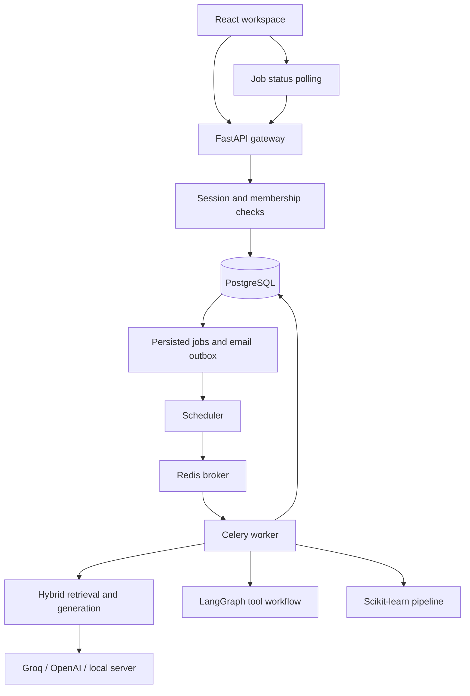

# System design and implementation boundaries

Workbench is a runnable AI engineering portfolio application, with a React/TypeScript client, a FastAPI gateway, SQLAlchemy persistence, and a Celery worker. Its purpose is to demonstrate inspectable AI behavior and real SaaS account/workspace flows. It is not certified for arbitrary production workloads.

## Request and data lifecycle

1. The browser holds a short-lived JWT in memory; an HttpOnly, SameSite Strict cookie carries the refresh token.
2. The gateway verifies JWT issuer/audience/type/expiry and looks up its revocable session. Tokens contain a user ID and session ID, never trusted tenant roles.
3. Every workspace route independently checks a live database membership. Viewer, member, admin, and owner permissions are enforced on the server.
4. A write locks the workspace row before quota/capacity checks. A job and its audit event are committed before dispatch.
5. A scheduler polls the durable job table, then submits job IDs to Redis. Broker downtime does not delete accepted jobs.
6. A worker claims a queued job using a row lock, increments its attempt count, and commits its running state. It persists results, traces, and terminal status in a transaction.
7. The client polls the workspace every four seconds. A run remains visible across reloads because the database owns history.

Redis stores rate-limit buckets and broker messages; it is not the source of truth for jobs. PostgreSQL stores users, memberships, token hashes, documents, chunks, jobs, datasets, notes, traces, and audit events. ML artifacts live in the shared `artifacts` volume and are generated only by the worker.

## Retrieval

Ingestion validates type/size, extracts text from text PDFs/TXT/Markdown, redacts common contact data and API-key patterns, and splits text into 1,800-character chunks with 250-character overlap. Document content is cleared after indexing. Exact duplicate document content is rejected per workspace.

The baseline uses 256-dimensional normalized feature hashing plus BM25, fused by reciprocal-rank fusion. Feature hashing is a lexical baseline, **not semantic embedding**. The optional sentence-transformer adapter produces real normalized semantic vectors; installing the extra downloads a model when first used. Changing embedding modes requires removing/reindexing documents because model IDs filter incompatible vectors.

Vectors are stored as JSON and searched exactly in the worker. The 5,000-chunk workspace cap makes this bounded and easy to run without a vector service. **This version does not implement pgvector, HNSW, cross-encoder reranking, or object storage.** A larger deployment should replace this adapter with a tenant-filtered ANN index and batched embeddings, keeping the API/result contracts stable. Benchmark retrieval recall and tenant filtering before doing so.

## Generation, evaluation, and safety

Groq and OpenAI use real HTTP Chat Completions adapters with a server-side key, configurable model, timeout, and bounded retry on throttling/transient failures. Local mode connects only to an operator-configured OpenAI-compatible inference URL; users cannot supply arbitrary URLs. The offline mode returns excerpts and reports zero token usage. It is deliberately not labeled as an LLM.

Input guardrails detect a small set of instruction-override patterns and redact common email/phone/API-key patterns. Evidence stays in the user-data channel, not the system instruction channel. Output checks redact contact data, validate citation IDs, and refuse uncited provider answers. **These checks are heuristics: they do not guarantee injection resistance or factual entailment.** Document instructions may still influence a model; redaction is not a comprehensive data-loss prevention system.

Evaluation stores labeled golden cases and calculates token F1, expected-phrase matching, Recall@5, MRR, safety/refusal matches, and latency. Safety/refusal labels are hard gates. An optional JSON-validated LLM judge adds advisory correctness/grounding assessments. Judge outputs are not the deterministic pass/fail gate and require calibration against human labels.

The measured token count is provider-reported; dollar cost is not estimated with stale prices. Traces avoid raw question/evidence text, but run history and uploaded datasets are private workspace data and still require a retention policy.

## Agent execution

A LangGraph workflow performs input checks, selects one of two allowlisted read-only tools (`knowledge_search`, `workspace_stats`), runs it, and reviews the result. Live providers choose the tool; offline mode uses a deterministic selector. There are no shell, arbitrary SQL, arbitrary URL, or external write tools. The graph has bounded recursion and execution length.

A proposed note is persisted with `awaiting_approval` status. Only an owner/admin can approve; a row lock and unique note/job constraint prevent duplicate approvals. An approved note is a local workspace action, never an email or external action.

The persisted job is the checkpoint boundary. A process restart may replay read-only graph nodes; this version does not claim per-node LangGraph checkpoint/resume. The write happens in a separate, authorized transaction.

## Reliability and operations

- Jobs use late acknowledgements and a 300-second hard task timeout. The scheduler recovers runs older than 600 seconds, up to three attempts. Long evaluation sets can exceed the timeout; use small sets or split them.
- Delivery is at least once. Job state/row locking, idempotent chunk ordinals, and approved-note uniqueness limit duplicate effects. SMTP can deliver the same email twice if the process dies between sending and committing.
- Structured HTTP logs include generated request IDs, route templates, status, and duration. They omit authorization headers and bodies.
- Prometheus exports HTTP counts and latency; application traces contain provider/model/tokens/guardrail outcomes. The planner trace's latency is measured separately from the RAG trace.
- Liveness checks the process. Readiness checks the DB and Redis; it does not guarantee that a worker is running. Alert separately on queued-job age, failed emails, dead workers, disk capacity, and provider error rate.
- Development can fall back to a local rate limiter if Redis is absent. Production fails closed instead. SQLite is for development/tests; PostgreSQL row locks are needed for concurrent production writes.
- Alembic owns startup schema creation. A dedicated migration service runs before the gateway, worker, and scheduler.

## ML and quantization

CSV training is bounded to 30–10,000 rows and 60 columns. A fixed-seed 75/25 holdout split is made before fitting imputation/scaling/encoding. Classification supports logistic regression/random forest; regression supports Ridge/random forest. Reports show holdout metrics and classification confusion matrices. Prediction loads only a server-created model artifact after workspace authorization. Users cannot upload model pickle files. This is a baseline experiment flow, not automated feature engineering or full MLflow model governance.

The CUDA benchmark runs FP16, INT8, and NF4 in separate processes, warms up inference, and reports load time, peak allocated memory, tokens/second, versions, and generated text. It refuses CPU/disk-offloaded models. Use one GPU for a meaningful memory comparison: the report measures CUDA device 0. Reports imported through the UI are **user-supplied measurements**, not remotely attested results. Benchmark answer quality with evaluations too; lower memory does not guarantee acceptable quality. This environment did not run a GPU benchmark.

## Scaling path

| Pressure | Current tradeoff | Next measured change |
|---|---|---|
| Growing knowledge | Bounded exact vector search | Tenant-filtered pgvector/ANN; offline Recall@K regression |
| Large uploads | Text stored until indexed | Object storage with signed upload URLs and lifecycle policies |
| Longer agent graphs | Read-only node replay | Persisted LangGraph checkpoints plus tool idempotency keys |
| High API traffic | Synchronous ORM in FastAPI thread pool | Profile first; tune pool/workers and consider async DB access |
| Larger experiment sets | One evaluation job | Per-case fan-out, aggregate results, explicit token budgets |
| More tenants | Application membership filtering | Defense-in-depth PostgreSQL RLS and isolation load tests |
| Model governance | Reports and trace history | Model registry, approval policy, drift monitoring |

Paid subscription billing, enterprise SSO/MFA, Kubernetes provisioning, fine-tuning, and external write tools are not implemented in this version. They require a product policy and additional integration/testing rather than decorative UI controls.
